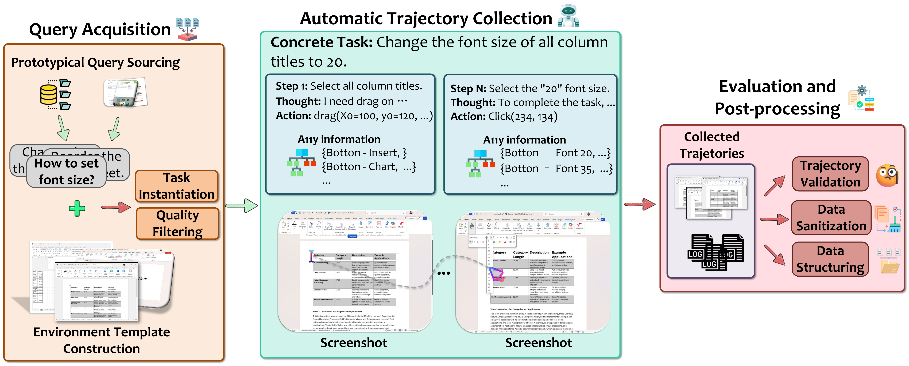

<div align="center">

# 🌐 GUI-360°

### A Comprehensive Dataset And Benchmark For Computer-Using Agents

[]()
[](https://huggingface.co/datasets/vyokky/GUI-360)
[](LICENSE)

[📄 Paper]() • [🤗 Dataset](https://huggingface.co/datasets/vyokky/GUI-360)

</div>

---

## 📋 Table of Contents

- [Introduction](#-introduction)
- [Installation](#-installation-and-quick-start)
- [Supported Tasks](#-supported-tasks)
- [Supported Models](#-supported-models)
- [Benchmark Results](#-benchmark-results)
- [Data Conversion](#-data-conversion-for-training)
- [Advanced Usage](#-advanced-usage)
- [Citation](#-citation)

---

<div align="center">

</div>

## 🎯 Introduction

We introduce **GUI-360°**, a large-scale, comprehensive dataset and benchmark suite designed to advance **computer-using agents** (CUAs). CUAs present unique challenges and are constrained by three persistent gaps:

1. 🔍 **Scarcity of real-world CUA tasks**
2. 🔄 **Lack of automated collection-and-annotation pipelines** for multi-modal trajectories
3. 📊 **Absence of unified benchmark** that jointly evaluates GUI grounding, screen parsing, and action prediction

### 🌟 Key Features

GUI-360° addresses these gaps with a **large-scale automated pipeline** for:
- ✨ Query sourcing
- 🏗️ Environment-template construction
- 🔧 Task instantiation
- ⚡ Batched execution
- 🤖 LLM-driven quality filtering

### 📦 Dataset Statistics

The released corpus contains:
- 📊 **1.2M+ executed action steps** across thousands of trajectories
- 💻 Popular Windows office applications (Word, Excel, PowerPoint)
- 🖼️ **Full-resolution screenshots** 
- ♿ **Accessibility metadata** (when available)
- 🎯 **Instantiated goals** and **reasoning traces**
- ✅ Both **successful** and **failed** trajectories

### 🎨 Supported Tasks

| Task | Description | Input | Output |
|------|-------------|-------|--------|
| 🎯 **GUI Grounding** | Locate UI elements by text | Screenshot + description | Coordinates |
| 🔍 **Screen Parsing** | Extract UI control information | Screenshot | Structured elements |
| 🤖 **Action Prediction** | Predict next action | Screenshot + goal + history | Action + args |

The dataset supports a **hybrid GUI+API action space** that reflects modern agent designs. Benchmarking state-of-the-art vision-language models on GUI-360° reveals substantial out-of-the-box shortcomings in grounding and action prediction; **supervised fine-tuning yields significant gains**.

---

## 🚀 Installation and Quick Start

### 1. 📥 Install Dependencies

First, clone the repository and install the required dependencies:

```bash
# Clone the repository
git clone <repository_url>
cd GUI360°

# Install Python dependencies
pip install -r requirements.txt
```

**📦 Key dependencies include:**

| Package | Version | Purpose |
|---------|---------|---------|
| PyTorch | >=2.0.0, <2.5.0 | Deep learning framework |
| Transformers | >=4.37.0 | Model inference |
| Pillow | >=8.0.0 | Image processing |
| Azure Storage SDK | latest | Data access |
| Sentence-Transformers | latest | Screen parsing evaluation |
| NumPy, einops, etc. | latest | ML utilities |

### 2. 📁 Prepare the Dataset

Download the GUI-360° dataset and organize it in the following structure:

```
<dataset_root>/
├── data/
│   ├── <domain>/                # e.g., word, excel, ppt
│   │   ├── <category>/
│   │   │   └── success/
│   │   │       └── *.jsonl      # Trajectory files
└── image/
    ├── <domain>/
    │   ├── <category>/
    │   │   └── success/
    │   │       └── *.png          # Screenshots
```

For detailed dataset structure, see [data_card_readme.md](data_card_readme.md).

### 3. 🔧 Deploy Your Model (Optional)

If you're using a custom model deployment, set up your model API endpoint. The framework supports:

- ✅ **OpenAI API-compatible endpoints** (for GPT models)
- ✅ **Custom model servers** (for open-source models)

**Example: Deploy Qwen2.5-VL-7B**

```bash
# Deploy your model server using vLLM
python -m vllm.entrypoints.openai.api_server \
    --model Qwen/Qwen2.5-VL-7B-Instruct \
    --port 19806
```

### 4. 🔑 Configure API Access

For GPT models, configure your OpenAI API credentials by setting environment variables:

```bash
# Required: Your OpenAI API key
export OPENAI_API_KEY="sk-your_openai_api_key_here"

# Optional: Custom API base URL (defaults to OpenAI official API)
export OPENAI_BASE_URL="https://api.openai.com/v1"
```

**🔍 Verify Configuration:**
```bash
# Test your API configuration
python -c "
import os
from openai import OpenAI
client = OpenAI(api_key=os.getenv('OPENAI_API_KEY'))
response = client.chat.completions.create(
    model='gpt-4o-mini',
    messages=[{'role': 'user', 'content': 'Hello!'}],
    max_tokens=10
)
print('✅ OpenAI API configuration successful!')
print(f'Response: {response.choices[0].message.content}')
"
```

### 5. ▶️ Run Evaluation

Run the evaluation framework with the desired task and model:

**📍 GUI Grounding with GPT-4o**
```bash
python evaluation.py \
    --root_dir /path/to/dataset/grounding \
    --type grounding \
    --model_type gpt \
    --model_name gpt-4o \
    --threads 5 \
    --output_dir results/grounding
```

**🤖 Action Prediction with Qwen2.5-VL-7B**
```bash
python evaluation.py \
    --root_dir /path/to/dataset/action_prediction \
    --type action_prediction \
    --model_type qwen2.5_vl_7b \
    --model_name Qwen/Qwen2.5-VL-7B-Instruct \
    --api_url http://localhost:19806/v1 \
    --threads 5 \
    --output_dir results/action_prediction
```

**🔍 Screen Parsing**
```bash
python evaluation.py \
    --root_dir /path/to/dataset/screen_parsing \
    --type screen_parsing \
    --model_type gpt \
    --model_name gpt-4o \
    --threads 5 \
    --output_dir results/screen_parsing
```

### 6. 🔄 Resume from Previous Results

If evaluation is interrupted, you can resume from error cases:

```bash
python evaluation.py \
    --root_dir /path/to/dataset \
    --type action_prediction \
    --model_type gpt \
    --model_name gpt-4o \
    --resume_from results/evaluation_results_20241231_120000.json \
    --threads 5
```

---

## ⚙️ Evaluation Configuration

### 🎛️ Command-Line Arguments

| Argument | Type | Default | Description |
|----------|------|---------|-------------|
| `--root_dir` | `str` | **required** | Path to dataset root directory |
| `--type` | `str` | `grounding` | Evaluation type: `grounding`, `action_prediction`, `action_prediction_a11y`, `screen_parsing` |
| `--model_type` | `str` | `gpt` | Model type: `qwen2.5_vl_7b`, `gpt`, `gui_actor`, `uground`, `ui_tars`, `aguvis`, `omniparser`, `mock` |
| `--model_name` | `str` | varies | Model name or path |
| `--api_url` | `str` | `None` | API URL for model inference (e.g., `http://localhost:19806/v1`) |
| `--max_samples` | `int` | `None` | Maximum number of samples to evaluate (default: all) |
| `--threads` | `int` | `5` | Number of threads for parallel evaluation |
| `--output_dir` | `str` | `results` | Output directory for results |
| `--resume_from` | `str` | `None` | Path to previous results file to resume from |
| `--no_save` | `flag` | `False` | Do not save detailed results |
| `--log_level` | `str` | `INFO` | Logging level: `DEBUG`, `INFO`, `WARNING`, `ERROR` |

---

## 🎯 Supported Tasks

### 1. 🎯 GUI Grounding

> **Objective:** Locate the precise coordinates of a UI element on screen based on a textual description.

#### 📥 Input
- `screenshot_clean`: Path to the screenshot image (PNG)
- `thought`: Text description of the target UI element
- `resolution`: Screen resolution as `(width, height)`

#### 📤 Expected Output
- `coordinates`: A `[x, y]` tuple representing pixel coordinates of the target element

#### 📊 Evaluation Metrics
| Metric | Description |
|--------|-------------|
| **Success Rate** | % of samples where predicted coordinates fall within ground truth bounding box |
| **Avg. Execution Time** | Mean time per sample (seconds) |

#### 💡 Example
```json
{
  "thoughts": "The user wants to click the 'Bold' button in the toolbar",
  "coordinates": [450, 120]
}
```

---

### 2. 🔍 Screen Parsing

> **Objective:** Extract structured control information from a screenshot, identifying all UI elements and their properties.

#### 📥 Input
- `screenshot_clean`: Path to the screenshot image (PNG)
- `resolution`: Screen resolution as `(width, height)`

#### 📤 Expected Output
- `control_infos`: A list of dictionaries, each containing:
  - `control_text`: Text content of the control
  - `control_rect`: Bounding box as `[left, top, right, bottom]`
  - `control_type`: Type of control (optional)

#### 📊 Evaluation Metrics
| Metric | Description |
|--------|-------------|
| **Recall** | Ratio of correctly identified controls to total ground truth controls |
| **Precision** | Ratio of correctly identified controls to total predicted controls |
| **F1 Score** | Harmonic mean of recall and precision |
| **Text Similarity** | Average semantic similarity of control text (using Sentence-BERT) |
| **IoU Accuracy** | Average Intersection over Union for matched controls |
| **Avg. Execution Time** | Mean time per sample (seconds) |

#### 💡 Example
```json
[
  {
    "control_text": "Save",
    "control_rect": [100, 50, 150, 80],
    "control_type": "Button"
  },
  {
    "control_text": "Document Title",
    "control_rect": [200, 100, 600, 130],
    "control_type": "TextBox"
  }
]
```

---

### 3. 🤖 Action Prediction

> **Objective:** Predict the next action to take given a user instruction, current screenshot, and action history.

#### 📥 Input
- `screenshot_clean`: Path to the screenshot image (PNG)
- `request`: User's high-level goal/instruction
- `previous_actions`: List of previous action descriptions
- `resolution`: Screen resolution as `(width, height)`

#### 📤 Expected Output
A structured action with:
- `function`: Action type (`click`, `type`, `drag`, `scroll`, `hotkey`, `wait`)
- `args`: Arguments for the action (varies by function)
- `status`: Execution status (`CONTINUE`, `FINISH`)

**Supported Actions:**
| Function | Arguments | Example |
|----------|-----------|---------|
| `click` | `coordinate`, `button` | `{"coordinate": [x, y], "button": "left"}` |
| `type` | `coordinate`, `keys` | `{"coordinate": [x, y], "keys": "text"}` |
| `drag` | `start_coordinate`, `end_coordinate` | `{"start_coordinate": [x1, y1], "end_coordinate": [x2, y2]}` |
| `scroll` | `coordinate`, `scroll_direction`, `scroll_amount` | `{"coordinate": [x, y], "scroll_direction": "down", "scroll_amount": 3}` |
| `hotkey` | `keys` | `{"keys": "ctrl+c"}` |

#### 📊 Evaluation Metrics
| Metric | Description |
|--------|-------------|
| **Success Rate** | % of samples where function, arguments, and status all match |
| **Function Match Rate** | % of correct function predictions |
| **Args Match Rate** | % of correct argument predictions (with coordinate tolerance) |
| **Status Match Rate** | % of correct status predictions |
| **Avg. Execution Time** | Mean time per sample (seconds) |

#### 💡 Example
```json
{
  "thoughts": "I need to click the Bold button to make the text bold",
  "tool_call": {
    "function": "click",
    "args": {
      "coordinate": [450, 120],
      "button": "left"
    },
    "status": "CONTINUE"
  }
}
```

---

### 4. ♿ Action Prediction with Accessibility (A11y)

> **Objective:** Similar to action prediction, but leverages accessibility tree information for more informed decisions.

#### 📥 Input
- Same as Action Prediction, plus:
- `control_infos`: Structured accessibility information (UI element metadata)

#### 📤 Expected Output
- Same as Action Prediction

#### 📊 Evaluation Metrics
- Same as Action Prediction

---

## 🤖 Supported Models

The framework supports multiple vision-language models through a unified interface. Each model can be evaluated on different tasks depending on its capabilities.

### 📊 Model Capabilities Matrix

| Model | 🎯 Grounding | 🔍 Screen Parsing | 🤖 Action Prediction | ♿ A11y Action |
|-------|:------------:|:-----------------:|:--------------------:|:--------------:|
| **GPT-4o** | ✅ | ✅ | ✅ | ✅ |
| **GPT-4V** | ✅ | ✅ | ✅ | ✅ |
| **Qwen2.5-VL-7B** | ✅ | ✅ | ✅ | ✅ |
| **GUI-Actor** | ✅ | ❌ | ✅ | ❌ |
| **UGround** | ✅ | ❌ | ❌ | ❌ |
| **UI-TARS** | ✅ | ❌ | ✅ | ❌ |
| **Aguvis-7B-720P** | ✅ | ❌ | ✅ | ❌ |
| **OmniParser** | ❌ | ✅ | ❌ | ❌ |

---

## 📈 Benchmark Results

Below are the benchmark results for various models on the GUI-360° dataset.

### 1. 🎯 GUI Grounding

| Model | Success Rate (%) |
|-------|:----------------:|
| GPT-4o | 9.38 |
| GPT-4.1 | 11.44 |
| Qwen2.5-VL-7B | 35.78 |
| GUI-Actor | 54.50 |
| UGround-7B | 53.85 |
| UI-TARS-1.5 7B | 62.27 |
| Aguvis-7B | 50.50 |
| **Qwen2.5-VL-7B-SFT** | **82.30** |
| **UI-TARS-1.5 7B-SFT** | **82.49** |

<details>
<summary>📌 Metric Definitions</summary>

- **Success Rate**: Percentage of samples where predicted coordinates fall within ground truth bounding box

</details>

---

### 2. 🔍 Screen Parsing

| Model | Recall (%) | Precision (%) | F1 Score (%) | Text Sim. (%) | IoU Acc. (%) |
|-------|:----------:|:-------------:|:------------:|:-------------:|:------------:|
| GPT-4o | 1.4 | 3.4 | 1.9 | 14.7 | 22.9 |
| GPT-4.1 | 5.7 | 9.8 | 6.7 | 30.6 | 50.5 |
| o3 | 11.4 | 16.0 | 12.8 | 45.6 | 57.8 |
| GPT-5 | 8.0 | 11.1 | 8.9 | 30.4 | 56.9 |
| Qwen2.5-VL-7B | 1.0 | 18.1 | 1.5 | 11.3 | 21.1 |
| **OmniParser** | **45.9** | **41.1** | **40.6** | **56.5** | **73.1** |
| **OmniParser v2** | **46.2** | **41.3** | **40.8** | **56.8** | **73.5** |

<details>
<summary>📌 Metric Definitions</summary>

- **Recall**: Ratio of correctly identified controls to total ground truth controls
- **Precision**: Ratio of correctly identified controls to total predicted controls
- **F1 Score**: Harmonic mean of recall and precision
- **Text Similarity**: Average semantic similarity of control text (using Sentence-BERT)
- **IoU Accuracy**: Average Intersection over Union for matched controls

</details>

---

### 3. 🤖 Action Prediction (Visual-only)

| Model | Success Rate (%) |
|-------|:----------------:|
| GPT-4o | 3.12 |
| GPT-4.1 | 2.82 |
| GPT-o3 | 17.92 |
| GPT-5 | 8.59 |
| Qwen2.5-VL-7B | 17.52 |
| **Qwen2.5-VL-7B-SFT** | **50.08** |

<details>
<summary>📌 Metric Definitions</summary>

- **Success Rate**: Percentage of samples where the predicted action matches the ground truth action (considering function, arguments, and execution status)

</details>

---

### 4. ♿ Action Prediction with Accessibility (Visual+A11y)

| Model | Success Rate (%) |
|-------|:----------------:|
| GPT-4o | 36.71 |
| GPT-4.1 | 39.19 |
| GPT-o3 | 46.72 |
| GPT-5 | 34.86 |
| Qwen2.5-VL-7B | 14.18 |
| **Qwen2.5-VL-7B-SFT** | **25.78** |

<details>
<summary>📌 Metric Definitions</summary>

- **Success Rate**: Same metric as Visual-only Action Prediction
- **A11y Advantage**: This variant provides accessibility tree information as additional input. GPT models show significant improvement with A11y information, while Qwen2.5-VL-7B-SFT performs better in Visual-only mode.

</details>

---

## 🔧 Model Configuration Guide

### 🌟 GPT Models (OpenAI API)

**🔧 Step 1: Configure API Access**

Set your OpenAI API credentials:
```bash
# Required: Your OpenAI API key
export OPENAI_API_KEY="sk-your_openai_api_key_here"

# Optional: Custom API base URL (defaults to OpenAI official API)
export OPENAI_BASE_URL="https://api.openai.com/v1"
```

**🚀 Step 2: Run Evaluation Commands**

```bash
# GPT-4o (recommended for best performance)
python evaluation.py \
    --root_dir /path/to/dataset \
    --type grounding \
    --model_type gpt \
    --model_name gpt-4o \
    --threads 5

# GPT-4o-mini (faster and cheaper)
python evaluation.py \
    --root_dir /path/to/dataset \
    --type action_prediction \
    --model_type gpt \
    --model_name gpt-4o-mini \
    --threads 10
```

**✅ Requirements:**
- OpenAI API key configured via environment variable `OPENAI_API_KEY`
- Internet connection for API access
- Valid OpenAI subscription with sufficient credits

---

### 🎨 Qwen2.5-VL-7B

**Step 1: Deploy Model Server**
```bash
python -m vllm.entrypoints.openai.api_server \
    --model Qwen/Qwen2.5-VL-7B-Instruct \
    --port 19806
```

**Step 2: Run Evaluation**
```bash
python evaluation.py \
    --root_dir /path/to/dataset \
    --type action_prediction \
    --model_type qwen2.5_vl_7b \
    --model_name Qwen/Qwen2.5-VL-7B-Instruct \
    --api_url http://localhost:19806/v1 \
    --threads 5
```

**✅ Requirements:**
- vLLM or compatible inference server
- GPU with sufficient memory (recommended: 16GB+ VRAM)

---


### 🔍 OmniParser

> **⚠️ Important:** Before using OmniParser, you need to configure the model paths in `evaluation.py`.

**Step 1: Edit Configuration in `evaluation.py`** (lines 136-144)

```python
config = {
    'som_model_path': '../../weights/icon_detect/model.pt',  # Update this path
    'caption_model_name': 'florence2',
    'caption_model_path': '../../weights/icon_caption_florence',  # Update this path
    'device': 'cuda',  # Or 'cpu' if no GPU available
    'BOX_TRESHOLD': 0.05,
    'host': host,
    'port': port
}
```

**Step 2: Download OmniParser Model Weights**
- **SOM (Set-of-Mark) model**: Place at the path specified in `som_model_path`
- **Caption model (Florence-2)**: Place at the path specified in `caption_model_path`

**Step 3: Deploy the OmniParser API Server**

```bash
python omniparser_server.py \
    --som_model_path /path/to/weights/icon_detect/model.pt \
    --caption_model_path /path/to/weights/icon_caption_florence \
    --host 0.0.0.0 \
    --port 7861
```

**Step 4: Run Evaluation**

```bash
python evaluation.py \
    --root_dir /path/to/dataset \
    --type screen_parsing \
    --model_type omniparser \
    --model_name omniparser-screen-parsing \
    --api_url http://localhost:7861 \
    --threads 5
```

**✅ Requirements:**
- OmniParser model weights (SOM and Florence-2 caption model)
- OmniParser API server running
- Model paths configured in `evaluation.py` ModelFactory class

---

## 📊 Output Format

### 📁 Evaluation Results

After evaluation completes, results are saved to the specified output directory:

```
results/
├── evaluation_results_<timestamp>.json    # Detailed results for all samples
└── evaluation_summary_<timestamp>.json    # Summary statistics
```

**📈 Summary Statistics Include:**
- ✅ Total samples evaluated
- 🎯 Success count and rate
- ❌ Error count and rate
- ⏱️ Average execution time
- 📂 Domain and category breakdowns
- 📊 Task-specific metrics (e.g., recall, precision for screen parsing)

### 💡 Example Summary Output

```json
{
  "total_samples": 1000,
  "success_count": 850,
  "success_rate": 85.0,
  "error_count": 10,
  "error_rate": 1.0,
  "avg_execution_time": 2.35,
  "model_name": "gpt-4o",
  "model_type": "gpt",
  "evaluation_time": "2024-12-31 12:00:00",
  "domain_stats": {
    "word": {
      "total": 400,
      "success": 340,
      "success_rate": 85.0
    },
    "excel": {
      "total": 300,
      "success": 255,
      "success_rate": 85.0
    },
    "ppt": {
      "total": 300,
      "success": 255,
      "success_rate": 85.0
    }
  }
}
```

---

## 🔄 Data Conversion for Training

We provide tools to convert the GUI-360° raw dataset into task-specific training formats suitable for vision-language model fine-tuning.

### 🎯 Supported Training Tasks

| Task | Description | Use Case |
|------|-------------|----------|
| **Action Prediction** | Multi-turn conversations with action sequences | Train agents to predict next GUI actions |
| **Action Prediction + A11y** | Action prediction with accessibility information | Leverage accessibility trees for better performance |
| **Screen Parsing** | Extract UI elements from screenshots | Train models to understand GUI structure |
| **GUI Grounding** | Locate UI elements by text descriptions | Train models for GUI element localization |

### 🚀 Quick Start

```bash
# Navigate to converter directory
cd convertor

# Convert to action prediction format with image optimization
python convert_to_train.py \
    --root_dir /path/to/GUI360_dataset \
    --output_dir /path/to/training_data \
    --type action_prediction \
    --resize \
    --max_pixels 500000

# Convert to screen parsing format
python convert_to_train.py \
    --root_dir /path/to/GUI360_dataset \
    --output_dir /path/to/training_data \
    --type screen_parsing \
    --resize
```

**📖 For detailed instructions, examples, and advanced options, see [convertor/README.md](convertor/README.md)**

---

## 🛠️ Advanced Usage

### 🔌 Custom Model Integration

To integrate a custom model:

1. **Create a new model class** in `models/` inheriting from `BaseModel`
2. **Implement required methods:**
   - `predict(system_prompt, user_prompt, image_path, ...)`
   - `construct_<task>_prompt(...)` for each supported task
   - `parse_<task>(response)` for each supported task
3. **Add model factory entry** in `evaluation.py`:

```python
@staticmethod
def _load_custom_model(model_name: str, api_url: str = None):
    from models.custom_model import CustomModel
    return CustomModel(model_name=model_name, api_url=api_url)
```

4. **Update the `create_model` method** to include the new model type

---

### ⚡ Parallel Evaluation

The framework supports multi-threaded evaluation for faster processing:

```bash
python evaluation.py \
    --root_dir /path/to/dataset \
    --type action_prediction \
    --model_type gpt \
    --model_name gpt-4o \
    --threads 20  # Increase for faster evaluation
```

**⚠️ Note:** Adjust thread count based on:
- 🚦 API rate limits
- 💻 Available system resources
- 🖥️ Model server capacity

---

### 🧪 Evaluation on Subset

To evaluate on a limited number of samples (useful for quick testing):

```bash
python evaluation.py \
    --root_dir /path/to/dataset \
    --type grounding \
    --model_type gpt \
    --model_name gpt-4o \
    --max_samples 100  # Only evaluate 100 samples
```

---

## 📝 Citation

If you use GUI-360° in your research, please cite:

```bibtex

```

---

## 📄 License

This project is released under the MIT License. See the [LICENSE](LICENSE) file for details.

---

## 💬 Contact & Support

For questions, issues, or contributions:

- 📧 **Email**: [contact email]
- 🐛 **Issues**: [GitHub Issues](repository URL)
- 💬 **Discussions**: [GitHub Discussions](repository URL)

---


